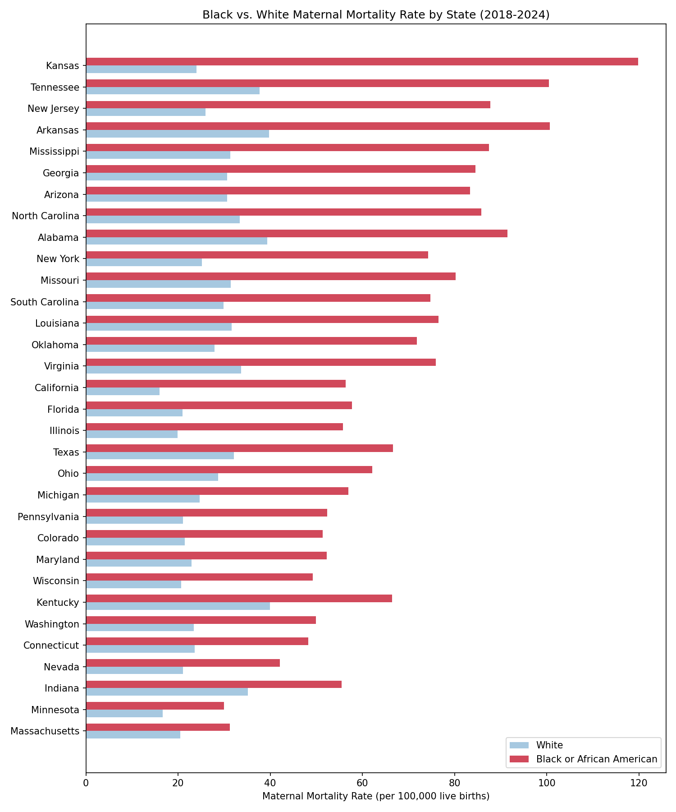
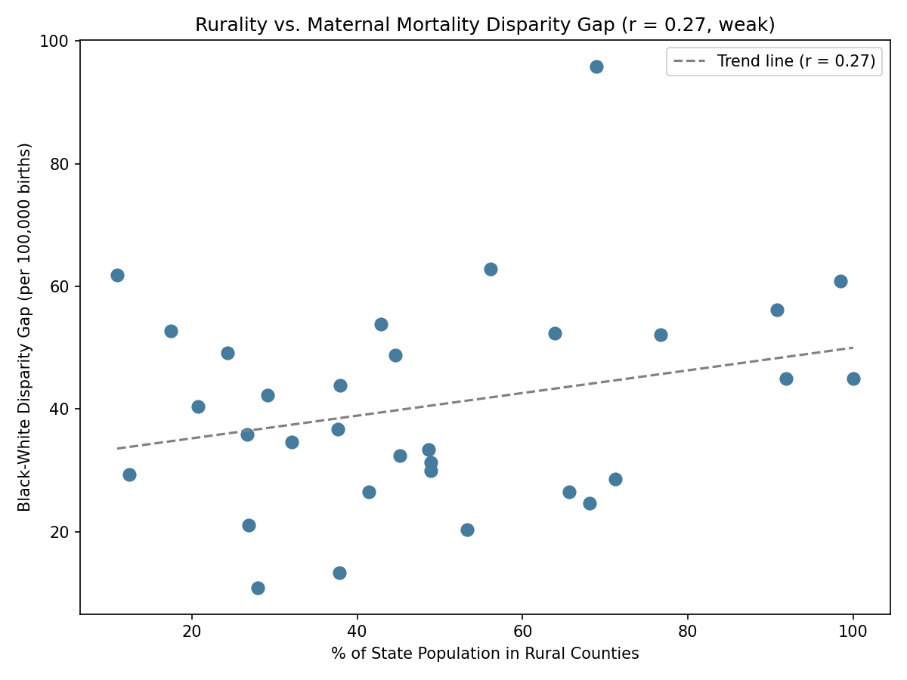

# Racial Disparities in U.S. Maternal Mortality: A Geographic Analysis

## Why this project
Black women in the U.S. die from pregnancy-related causes at a substantially higher
rate than white women — a gap that has persisted for decades. This project examines
that disparity across U.S. states from 2018-2024, and tests whether the size of the
racial gap is associated with how rural or urban a state is.

## Research question
How does pregnancy-related mortality by race compare across U.S. states, and does
the size of the racial gap correlate with rural vs. urban access to maternal care?

## Data sources
- **CDC WONDER** — Natality and Underlying Cause of Death databases
  (https://wonder.cdc.gov/), queried for pregnancy-related mortality (ICD-10 codes
  O00-O99) by state and mother's race, 2018-2024
- **NCHS Urban-Rural Classification Scheme for Counties** — used to classify
  each state's counties, aggregated to a state-level rural share (both by county
  count and by population)

## Method
1. Queried CDC WONDER for pregnancy-related deaths and live births by state and
   race (Black, White), 2018-2024, and calculated a maternal mortality rate per
   100,000 live births for each state/race combination.
2. Joined this with NCHS county-level rural classification, aggregated to two
   state-level rurality measures: percent of counties rural, and percent of
   population living in rural counties.
3. Calculated the racial disparity gap (Black rate − White rate) and ratio
   (Black rate / White rate) for each of the 32 states with complete data for
   both races.
4. Tested correlation between rurality and disparity size using Pearson correlation.
5. Visualized with a bar chart comparing Black vs. White rates by state, and a
   scatterplot of rurality vs. disparity gap.

## Key finding
In all 32 states with complete data, the Black maternal mortality rate exceeded
the White rate — with no exceptions — with gaps ranging from about 11 to 96 deaths
per 100,000 births. However, rurality showed only a weak correlation with the size
of that gap (r = 0.16 using percent-rural-counties, r = 0.27 using
population-weighted rurality) — well below the threshold typically needed to call
a relationship meaningful. This suggests the racial disparity is large and
consistent regardless of how rural or urban a state is, rather than being
specifically a rural-access problem.





## Repository structure
data/raw/ Original CDC WONDER and NCHS exports
images/ Final saved plots (PNG)
src/ Reusable Python functions (cleaning)
01_data_inspection.ipynb Full analysis notebook, step by step


## How to reproduce
```bash
git clone https://github.com/ephratahgenet/maternal-mortality-disparities-us.git
cd maternal-mortality-disparities-us
pip install -r requirements.txt
jupyter notebook 01_data_inspection.ipynb
```

## Data limitations
- CDC WONDER suppresses small counts (fewer than 10 deaths) for privacy, which
  reduced the usable sample to 32 states with complete Black and White race-level
  data — smaller, low-population states were disproportionately excluded.
- Rurality was tested at the state level using two measures (percent of counties
  rural, percent of population in rural counties). Neither showed a meaningful
  correlation with disparity size (r = 0.16 and r = 0.27, respectively). This
  doesn't rule out a rural-access effect but it may mean the effect exists at a
  finer grain (county- or hospital-level access, e.g. distance to the nearest
  obstetric unit or rural hospital closures) that state-level aggregation
  averages away.
- With only 32 states, the statistical power to detect a moderate correlation is
  limited; a weak result here is not strong evidence of "no relationship,"
  only evidence that a strong one is unlikely.
- Race on birth and death certificates is self-reported or assigned by a
  certifier, a known source of misclassification in vital statistics data.

## Author
Ephratah Genet — Columbia University, B.A. Computational Biology
[linkedin.com/in/ephratahgenet-010b45297](https://linkedin.com/in/ephratahgenet-010b45297)
